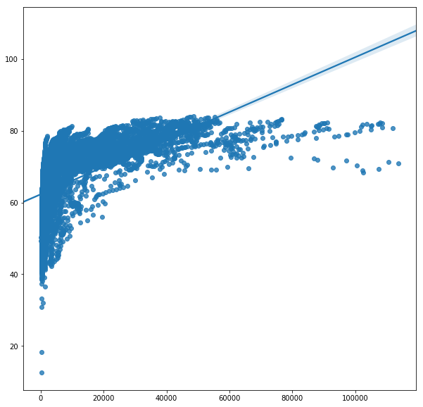
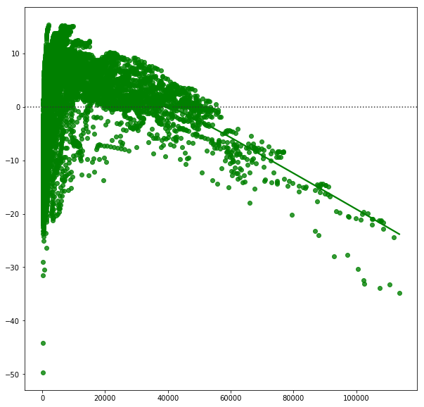
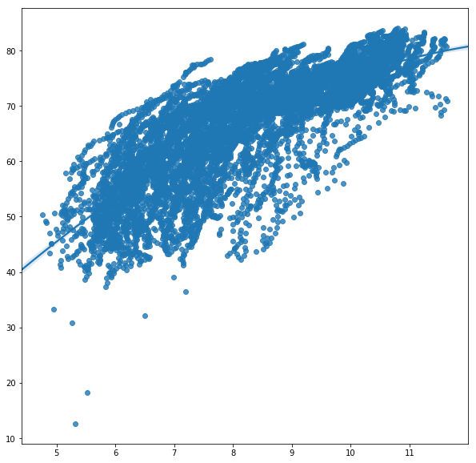
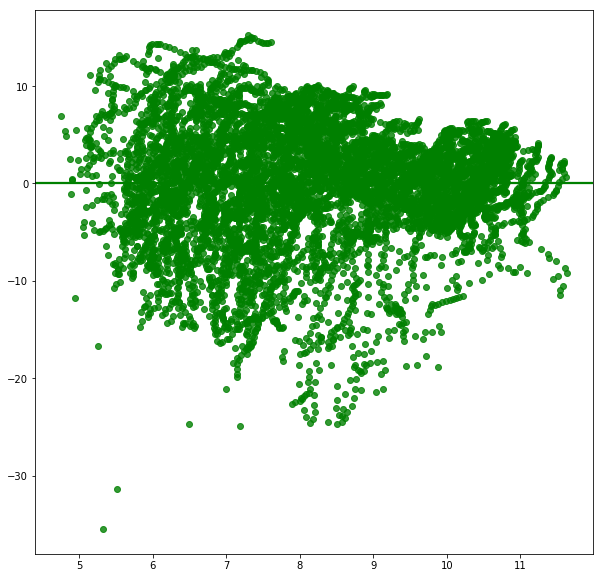
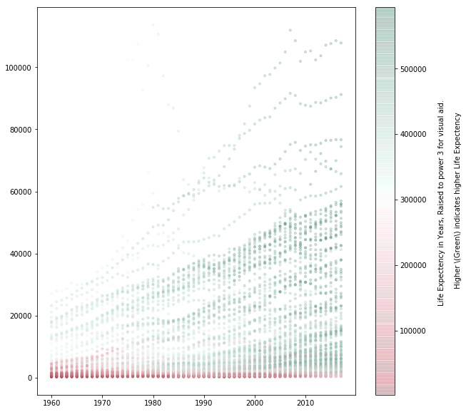
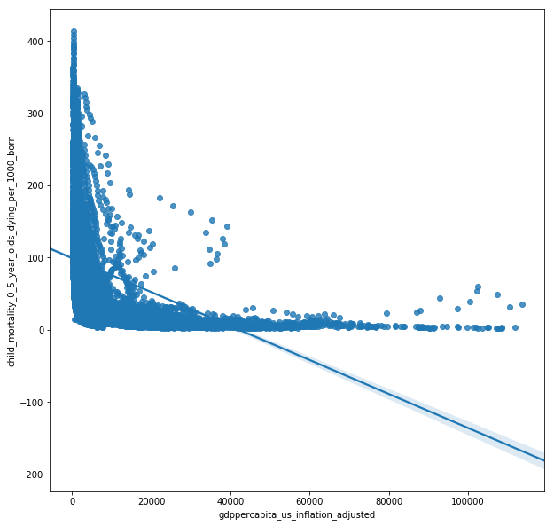
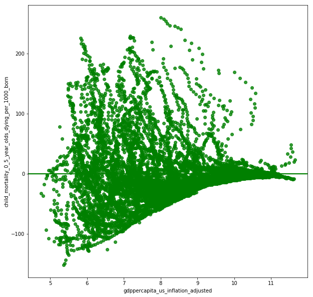
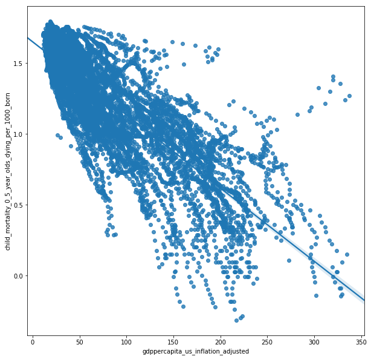
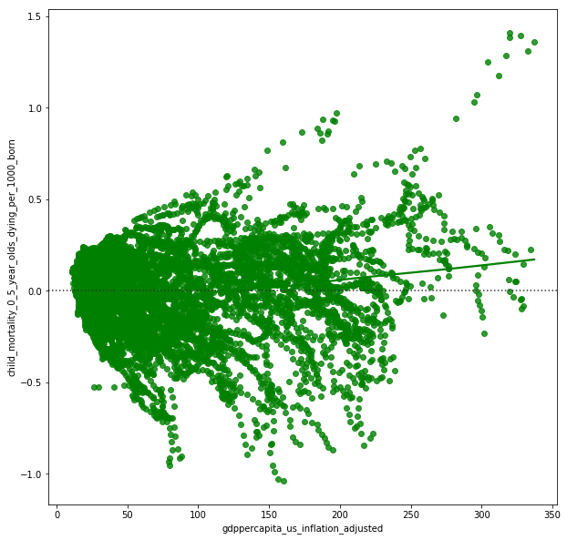
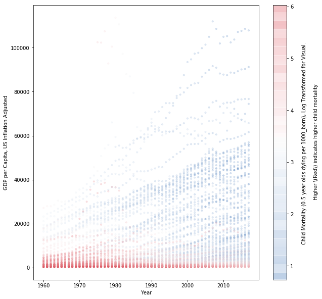

# ds5500-hw2
Homework 2 for DS5500

## Problem 2
The visualization that this critues can be found here.
https://nbviewer.jupyter.org/github/fhooton/DS5500_HW1/blob/master/solutions.ipynb

How is the visualization similar/different to mine?
The visualization uses a stacked area chart to show the distribution of GDB by continents and countries over time. While my visualization of choice is the same as his, my chart is static and his has an element of interactivity to it. The interactivity allows a user to explore the plots further.

Is it easy to interpret?
Yes, the visualization is fairly easy to interpret and effectively visualizes what is being asked. What I like is that the both continents and countires can be visualized in one chart. The option to zoom in is great! However, reflecting on the assignment, I imagine seperate plots for the continents might have been the better way to go, since both our plots make it harder to narrow down on individual countries. 

## Problem 3

How is the visualization similar/different to mine?
Again, the visualization is interactive allowing for an extra dimension in the plot. The visualization does the job of communicating the relationship over time really well. 

Is it easy to interpret?
It's easy to interpret and captures the relationship between the GDP per capita vs life expectancy and child mortality better.
Since there are four variables(gdp, life expectency, time and continent) to capture, an interactive plot makes perfect sense.

## Problem 4
To esblish a baseline a simple linear regression model was fit as X = GDP and Y = Life Expectancy as shown in the below figure. This model merely acheived an r-square of 0.338. Furthermore, this model had  a very high conditional value meaning it was extremely sensitive to the input variable.

Baseline line of fit:

Baseline residual:

Since the pattern looked logarithmic, (and it made sense that life expectency flattened out after 85), I decided to log tranform Y. Furthermore, the distribution of residuals still did not look normal and followed a negative curvature. To resolve that, I fit it to a second order polynomial. As shown in the plot below, this results in the residuals being normally distributed. The resulting r-sqaured increased to 0.622 and the condition value reduced to just 46.

Line of fit with X and Y log transformed:

Residuals with X and Y log transformed:

This model is represented by ***log(Y) = log(X) + X + C*** and achieved an r-squared of 0.60.

where, 
* Y = life_expectancy_years 
* X = gdppercapita_us_inflation_adjusted

Finally, using time as a covariate, we acheive an r-squared of 0.68.
This model has the formula ***log(Y) = log(X0) + X0 + X1 + C***

where, 
* Y = life_expectancy_years 
* X0 = gdppercapita_us_inflation_adjusted 
* X1 = time 

The p-values for both the variables are significant.

Visualizing all three together, we get:

As shown in the plot and confirmed by the model, time and GDP/capita together, independently contributed to the increase in life expectancy. This can be explained by increases in simple, cheap but effective technologies such as condoms and vaccines. GDP/capita has a more obvious, direct connection to increases in life expectancy with countries with higher GDP's being able to afford more sophisticated healthcare.

## Problem 5

The baseline regression model here with X = GDP/Capita and Y = Child mortality, we get a poor r-squared of 0.21.

Baseline line of fit:

Baseline residual:

Since the the relationship also looked like it was logarithimic, both X and Y were log transformed. The scatter plot looks as follows:

Line of fit with square_root(X) and Y log transformed:

Residuals with square_root(X) and Y log transformed:

As shown in the scatter plot, the residuals are normally distributed. The model was fit as follows:

***log(Y) = square_root(X0) + X0 + log(X1) + C***

where, 
* Y = life_expectancy_years
* X0 = gdppercapita_us_inflation_adjusted
* X1 = time

Visualizing all three together, we get:

Again, as shown in the plot and confirmed by the model, time and GDP/capita together, independently contributed to the decrease in Child Mortality. The contributing factors could again be simple, cheap yet effective care of the young with advances like vaccines, which tend to have a network effect - the more children that are vaccinated, the less likely someone who is not vaccinated, in the same commnity, is to get infected. Since children are likely to have a weaker immune system, the network effect is likly to be stronger. This might be the reason why time has a larger affect size in this case than in the case of life expectancy.
